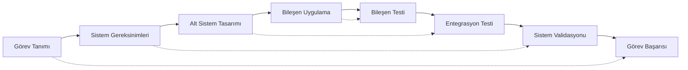

# 02. Sistem Mühendisliği ve Multidisipliner Entegrasyon

🏠 [Ana Sayfaya Dön](../README.md)

### Özet (Abstract)
Sistem Mühendisliği, bir füze veya mühimmatın sadece parçalarının toplamı değil, bu parçalar arasındaki etkileşimlerin yönetilmesidir. SAGE'de bir sistem mühendisi, yazılımın hızı ile donanımın ısısı, aerodinamiğin sürüklemesi (drag) ile motorun itkisi arasındaki o hassas dengeyi kuran bir "Sistem Orkestra Şefi"dir. Bu bölüm, karmaşık savunma sistemlerinin V-Modeli (Vee Model) çerçevesinde nasıl tasarlanıp entegre edildiğini teknik detaylarıyla ele alır.

---

## 📐 V-Modeli ve Gereksinimlerin Hiyerarşisi

SAGE'de tasarım süreci, üst düzey görev gereksinimlerinden (High-Level Requirements) en alt seviyedeki vida tork değerine kadar inen bir "İzlenebilirlik" (Traceability) zinciridir.

1. **Gereksinim Analizi:** "Mühimmat 40,000 feet irtifada Mach 0.9 hızla giderken hedefi vurmalı."
2. **Fonksiyonel Mimari:** Görevi alt sistemlere bölme (Güdüm, İtki, Kontrol).
3. **Tasarım ve Uygulama:** Kod yazımı ve CAD çizimi.
4. **Doğrulama ve Geçerli Kılma (V&V):** Her bir tasarım adımının karşı taraftaki test adımıyla eşleşmesi.

## ⚖️ Ödünleşim (Trade-off) Analizi: Mühendisliğin Sanatı
Hiçbir sistem mükemmel değildir; sadece "Yeterince İyi Optimize Edilmiş" sistemler vardır. SAGE mühendisliği, çelişen parametrelerin yönetimidir.

| Parametre A | Parametre B | Çelişki (Conflict) | Çözüm Yaklaşımı |
| :--- | :--- | :--- | :--- |
| **Menzil (Range)** | **Hız (Speed)** | Daha fazla yakıt = Daha fazla ağırlık = Daha fazla Drag. | Drag azaltıcı aerodinamik form ve yakıt enerjisi yoğunluğu optimizasyonu. |
| **Hassasiyet** | **Maliyet** | Daha iyi seeker = Daha yüksek maliyet. | "Yeterince İyi" sensör füzyonu algoritmalarıyla düşük maliyetli donanımı telafi etme. |
| **Zırh Delme** | **Ağırlık** | Daha ağır harp başlığı = Daha hantal mühimmat. | Patlama geometrisini ve jet oluşumunu optimize eden reaktif yapılar. |

## 🧩 Multidisipliner Optimizasyon (MDO)
SAGE'de bir mühendis sadece kendi alanını düşünemez.
* **Yazılım:** Algoritmanın karmaşıklığı, işlemci yükünü artırır.
* **Elektronik:** İşlemci yükü arttıkça PCB ısınır.
* **Mekanik:** Isınan PCB, çevresindeki yapısal elemanların termal genleşmesine neden olur.
* **Kontrol:** Genleşen gövde, aerodinamik katsayıları değiştirir.

Sistem mühendisi, bu zincirleme reaksiyonu önceden modelleyen (MBSE - Model Based Systems Engineering) kişidir.

---

## 🧠 Açık Mühendislik Problemi (Open Engineering Problem)
**Problem: "Değişken Kütle Merkezinde Kararlılık Yönetimi"**

Bir füze uçuşu sırasında katı yakıtını tüketir. Bu süreçte füzenin toplam ağırlığı azalırken Kütle Merkezi (CG - Center of Gravity) öne veya arkaya doğru kayar. Ancak Basınç Merkezi (CP - Center of Pressure) aerodinamik forma bağlı olarak sabittir (veya Mach sayısına göre değişir).

**Soru:** *Statik Kararlılık Marjı (Static Margin = CP - CG), yakıt tüketimi boyunca nasıl değişmelidir? CG'nin çok arkaya kayması kontrol kaybına (instability), çok öne kayması ise manevra kabiliyetinin azalmasına (excessive stability) neden olur. Yakıt tankı geometrisini ve yanma hızını öyle tasarlayın ki; füze hem başlangıçta çevik olsun hem de terminal safhada (yakıt bittiğinde) hedefi vuracak hassasiyette kararlı kalsın.*
