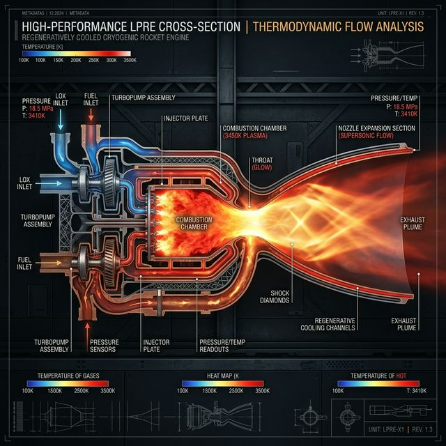

# 04. Malzeme Bilimi, İtki ve Termodinamik Kısıtlar

🏠 [Ana Sayfaya Dön](../README.md)

### Özet (Abstract)
Bir mühimmat veya füzenin menzili, hızı ve manevra kabiliyeti; yazılımın zekasıyla değil, fiziğin ve termodinamiğin katı sınırlarıyla belirlenir. SAGE'de itki ve malzeme mühendisliği, kimyasal enerjinin kinetik enerjiye en verimli şekilde dönüştürülmesi ve bu süreçte oluşan ekstrem sıcaklık ve basınç yüklerinin yönetilmesidir. Bu bölüm, katı yakıt teknolojilerinden hipersonik ısı kalkanlarına kadar sistemlerin "fiziksel iskeletini" inceler.

---

## 🔥 İtki Sistemleri: Enerjinin Kontrolü
SAGE mühimmatları, görev profiline göre farklı itki mimarilerine sahiptir. Bir roket motorunun ürettiği toplam itki (Thrust) denklemi:

$$ F = \dot{m} V_e + (p_e - p_a) A_e $$

Burada $\dot{m}$ kütlesel debi, $V_e$ çıkış hızı, $p_e$ çıkış basıncı ve $p_a$ ortam basıncıdır. Maksimum verimlilik için çıkış basıncı ile ortam basıncının eşitlenmesi (optimum genleşme) hedeflenir.

| İtki Tipi | Teknik Özellikler | Kullanım Amacı |
| :--- | :--- | :--- |
| **Katı Yakıt (Solid Rocket)** | HTPB tabanlı kompozit yakıtlar, yüksek itki/ağırlık oranı. | Kısa/Orta Menzilli Füzeler (Bozdoğan / Gökdoğan) |
| **Turbojet / Turbofan** | Jet A-1 yakıtı kullanımı, uzun süreli seyir yeteneği. | Seyir Füzeleri (SOM Serisi) |
| **Dual-Pulse Motor** | İki ayrı yanma odası, terminal safhada ek hızlanma. | Gökdoğan (BVR - Görüş Ötesi Menzil) |

## 🌡️ Aerodinamik Isınma ve Termal Yönetim
Hız arttıkça (özellikle Mach 3+ seviyelerinde), mühimmatın yüzeyindeki hava sürtünmesi sıcaklığı binlerce dereceye çıkarır. Durgunluk Sıcaklığı ($T_0$) şu formülle hesaplanır:

$$ T_0 = T \left( 1 + \frac{\gamma - 1}{2} M^2 \right) $$

Mach 5 hızında ($M=5$), ortam sıcaklığının 6 katına varan bir termal yük oluşur. Bu yükü yönetmek mühimmatın yapısal bütünlüğü için kritiktir.

## 🧱 Malzeme Bilimi ve Yapısal Analiz
Bir mühimmatın ağırlığını %5 azaltmak, menzilini %15 artırabilir.
* **Kompozit Gövde:** Karbon fiber takviyeli polimerler ile hafiflik ve dayanım dengesi.
* **G-Yükü Dayanımı:** 30G+ manevralar altında elektronik bileşenlerin ve mekanik bağlantıların kopmadan çalışabilmesi.

---

## 🧠 Açık Mühendislik Problemi (Open Engineering Problem)
**Problem: "Dual-Pulse Motor Ateşleme Zamanlaması Optimizasyonu"**

Hava-hava füzesi (Gökdoğan gibi), 100 km ötedeki bir hedefe fırlatılıyor. Füze, ilk itki modülüyle Mach 3 hıza ulaşıyor ve ardından sönümlenerek süzülmeye (glide phase) başlıyor. Elinizde terminal safhada (hedefe son 10 km kala) ateşleyebileceğiniz ikinci bir itki modülü (pulse) var.

**Soru:** *İkinci motoru tam olaral ne zaman ateşlemelisiniz? Erken ateşlerseniz terminal safhadaki enerjiniz (manevra kabiliyetiniz) biter. Geç ateşlerseniz hedef manevra yaparak kaçabilir. İkinci motor ateşlendiğinde kütle değişimi (fuel consumption) nedeniyle aerodinamik kararlılık anlık olarak bozulacaktır. Bu geçiş fazını "Kontrol Teorisi" ve "Balistik Enerji Yönetimi" perspektifiyle nasıl optimize edersiniz?*
