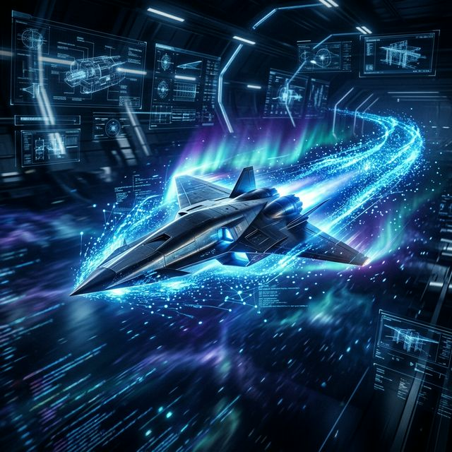
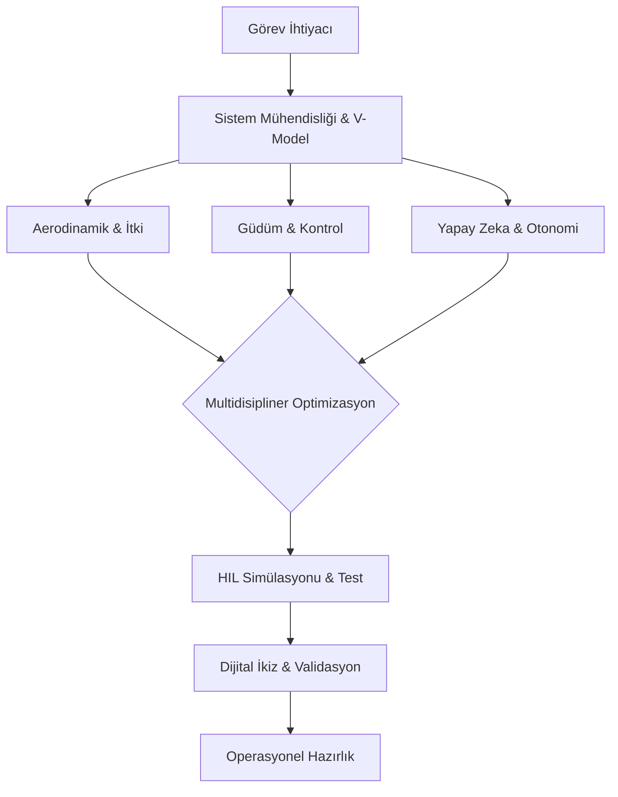

# 🔬 Anatomy of SAGE Engineering: Sistem Mimarisi ve Geleceğin Vizyonu

  
  
  

Bu depo (repository), TÜBİTAK Savunma Sanayii Araştırma ve Geliştirme Enstitüsü'nün (SAGE) geliştirdiği ileri teknoloji sistemleri incelemenin ötesine geçerek; SAGE'yi küresel çapta "Dünyanın En İyi Ar-Ge Merkezi" yapacak mühendislik felsefesini, yetkinlik setlerini ve multidisipliner vizyonu tanımlamak amacıyla oluşturulmuş bir sistem analizi ve yol haritası (roadmap) projesidir.

Amacımız, ortaya çıkan ürünleri listelemek değil; bu ürünlerin arkasındaki algoritmik temelleri irdelemek ve bu sistemleri yarından alıp geleceğe taşıyacak mühendis adaylarına **"Sistemik Düşünce" (Systems Thinking)** perspektifi kazandırmaktır.

---

## 📑 İçindekiler Mimarisi

1. [SAGE'nin Evrimi: Dünü, Bugünü ve Yarını](./01-SAGE-Evrimi/README.md)
2. [Sistem Mühendisliği ve Multidisipliner Entegrasyon](./02-Sistem-Muhendisligi-ve-Entegrasyon/README.md)
3. [Yapay Zeka, Otonomi ve Sensör Füzyonu](./03-Yapay-Zeka-Otonomi-Sensor-Fuzyonu/README.md)
4. [Malzeme Bilimi, İtki ve Termodinamik Kısıtlar](./04-Malzeme-Itki-Termodinamik/README.md)
5. [Test Altyapıları ve Dijital İkiz (Digital Twin)](./05-Test-Altyapilari-Dijital-Ikiz/README.md)
6. [Geleceğin SAGE Mühendisi: Dünyanın En İyisini İnşa Etmek](./06-Gelecegin-SAGE-Muhendisi/README.md)

---

## 1. SAGE'nin Evrimi: Dünü, Bugünü ve Yarını
Bir kurumun geleceğini inşa etmek için onun teknolojik hafızasını okumak gerekir.

* **Dünü (Temel Atma ve Tersine Mühendislik):** Dışa bağımlılığın getirdiği krizleri aşmak için tersine mühendislik faaliyetleriyle başlayan, alt sistem mekaniklerinin ve temel aerodinamik prensiplerin laboratuvar ortamında çözümlendiği dönem.
* **Bugünü (Milli Sistemler ve Özgün Mimari):** Akıllı mühimmatlar (HGK, KGK), seyir füzeleri (SOM) ve hava-hava füzeleri (Gökdoğan, Bozdoğan) ile uçtan uca sistem tasarımının, yerli algoritmaların ve donanım entegrasyonunun rüştünü ispatladığı olgunluk çağı.
* **Yarını (Küresel Liderlik ve Sınırların Ötesi):** Hipersonik hızlarda termal bariyerlerin aşıldığı, sürü zekasına (swarm intelligence) sahip otonom mühimmat ağlarının kurulduğu, yapay zeka destekli adaptif uçuş kontrol sistemlerinin ve uzay sınırındaki (exo-atmospheric) itki teknolojilerinin domine edeceği yeni çağ.

## 2. Sistem Mühendisliği ve Multidisipliner Entegrasyon
Farklı disiplinlerin (Yazılım, Elektronik, Mekanik) katı fiziksel kısıtlar altında nasıl optimize edildiği. (Bu bölümdeki detaylı analizler alt dizinlerde incelenmektedir.)

## 3. Yapay Zeka, Otonomi ve Sensör Füzyonu
Dinamik ortamlarda çalışan platformların kendi başlarına karar almasını sağlayan algoritmik yapılar, AINS (Bağımsız Navigasyon) ve gerçek zamanlı sensör veri işleme (Kalman Filtreleri vb.).

## 4. Malzeme Bilimi, İtki ve Termodinamik Kısıtlar
Aerodinamik ısınmaya dayanan kompozitler, katı/sıvı yakıtlı motor tasarımları ve yüksek G kuvvetlerine dayanan yapısal iskelet analizleri.

## 🔄 SAGE Sistemik Düşünce Mimarisi

---

## 6. Geleceğin SAGE Mühendisi: Dünyanın En İyisini İnşa Etmek (Yol Haritası)
SAGE'yi küresel bir teknoloji devriminin merkezine oturtacak mühendis; sadece kod yazan, sadece CAD çizen veya sadece devre tasarlayan bir teknisyen olamaz. O, büyük resmi gören bir **Multidisipliner Sistem Mimarı** olmalıdır.

Bir mühendis adayı bu seviyeye nasıl hazırlanmalı?

### I. Sistematik ve Çok Boyutlu Düşünce (Systems Thinking)
Bir parçayı tasarlarken tüm bütünü hesaba katmalısınız. Yazdığınız bir otonomi algoritmasının işlemci üzerinde yaratacağı ısının, çevresindeki mekanik yapıyı nasıl genleştireceğini ve bunun aerodinamiği nasıl bozacağını düşünebilmelisiniz.
* **Odaklanılacak Alan:** Sistem Mühendisliği süreçleri (V-Modeli), Gereksinim Yönetimi ve Trade-off (Ödünleşim) analizleri.

### II. Algoritma ve Temel Bilimler Kesişimi
Sadece kütüphane çağıran değil, fiziği ve matematiği koda dökebilen mühendisler fark yaratır. 
* **Odaklanılacak Alan:** İleri lineer cebir, diferansiyel denklemler, kontrol teorisi (PID, LQR, H-infinity), dijital sinyal işleme ve optimizasyon algoritmaları.

### III. Yapay Zeka ve Endüstriyel Optimizasyon
Geleceğin sistemleri deterministik kurallarla değil, olasılıksal ve adaptif zekayla çalışacak. SAGE'nin geleceği, donanım kısıtları (Edge AI) altında çalışan yüksek performanslı yapay zeka modellerindedir.
* **Odaklanılacak Alan:** Takviyeli Öğrenme (Reinforcement Learning), Sensör Füzyonu, Bilgisayarlı Görü ve Gömülü Sistemlerde Yapay Zeka.

### 🛠️ Teknoloji Ekosistemi (Core Tech Stack)

  
  
  
  

### IV. "Neden?" Sorusuna Takıntılı Olmak
Var olan mimarileri kabullenmek yerine, "Bu motoru %2 daha hafif yaparsak otonomi yazılımına ne kadar alan açarız?" veya "Bu algoritmada matris çarpım süresini mikrosaniye bazında nasıl düşürürüz?" gibi sorular sormalısınız. Başarı, marjinal kazanımların optimizasyonunda gizlidir.

---

## 🤝 Katkıda Bulunma
Bu repo, statik bir doküman değil, vizyoner mühendisler için yaşayan bir ekosistemdir. Sistem tasarımları, endüstriyel optimizasyon ve otonomi konularında SAGE vizyonunu ileriye taşıyacak herkesin katkılarına (Pull Request) açıktır.

**Araştırmacı & Küratör:**
[Bahattin Yunus](https://github.com/bahattinyunus)
*Multi-Disciplinary Systems Designer | Solopreneur | AI & Industrial Optimization*